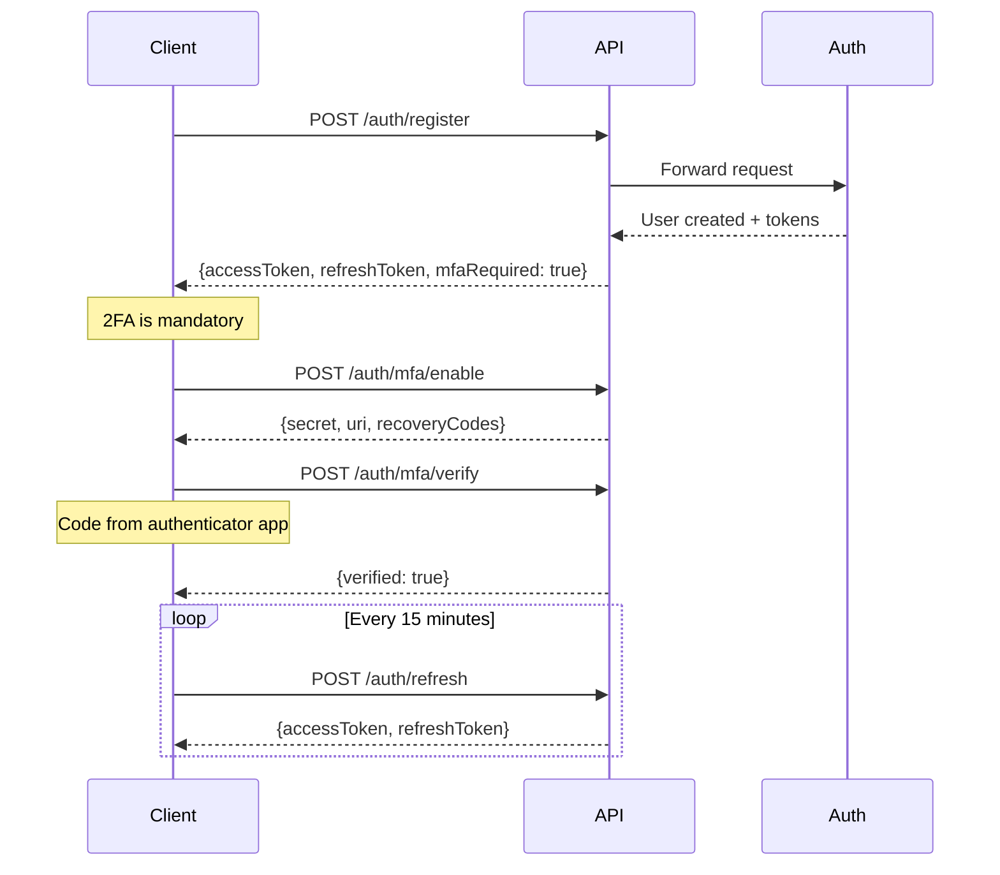

# Authentication Guide

The Cinacoin API uses JWT (JSON Web Tokens) for authentication. This guide covers the complete authentication flow, including registration, login, 2FA, and token management.

## Authentication Flow



## Registration

Create a new user account:

```bash
curl -X POST https://api.cinacoin.com/auth/register \
  -H "Content-Type: application/json" \
  -d '{
    "email": "alice@example.com",
    "username": "alice",
    "password": "SecureP@ss123",
    "displayName": "Alice Smith"
  }'
```

**Response:**

```json
{
  "success": true,
  "data": {
    "accessToken": "eyJhbGciOiJIUzI1NiIs...",
    "refreshToken": "eyJhbGciOiJIUzI1NiIs...",
    "expiresIn": 900,
    "tokenType": "Bearer",
    "user": {
      "id": "usr_abc123",
      "email": "alice@example.com",
      "username": "alice",
      "displayName": "Alice Smith",
      "role": "user",
      "status": "active"
    }
  }
}
```

**Validation Rules:**
- `email`: Valid email format, must be unique
- `username`: 3-30 characters, alphanumeric + underscore/hyphen, must be unique
- `password`: Minimum 8 characters
- `displayName`: Optional, max 100 characters

## Two-Factor Authentication (2FA)

**2FA is mandatory for all users.** After registration, you must complete 2FA setup before making authenticated requests.

### Step 1: Enable 2FA

```bash
curl -X POST https://api.cinacoin.com/auth/mfa/enable \
  -H "Authorization: Bearer YOUR_ACCESS_TOKEN"
```

**Response:**

```json
{
  "success": true,
  "data": {
    "methodId": "mfa_xyz789",
    "secret": "JBSWY3DPEHPK3PXP",
    "uri": "otpauth://totp/Cinacoin:alice@example.com?secret=JBSWY3DPEHPK3PXP&issuer=Cinacoin",
    "recoveryCodes": [
      "abcd-1234-efgh",
      "ijkl-5678-mnop",
      "qrst-9012-uvwx"
    ]
  }
}
```

**Important:**
- Scan the QR code (from `uri`) with your authenticator app (Google Authenticator, Authy, etc.)
- Save the `recoveryCodes` in a secure location — they're your backup if you lose access to your authenticator
- The `secret` is shown only once

### Step 2: Verify 2FA Setup

```bash
curl -X POST https://api.cinacoin.com/auth/mfa/verify \
  -H "Authorization: Bearer YOUR_ACCESS_TOKEN" \
  -H "Content-Type: application/json" \
  -d '{
    "code": "123456"
  }'
```

**Response:**

```json
{
  "success": true,
  "data": {
    "verified": true,
    "mfaEnabled": true,
    "message": "MFA has been successfully enabled"
  }
}
```

### Check 2FA Status

```bash
curl https://api.cinacoin.com/auth/mfa/status \
  -H "Authorization: Bearer YOUR_ACCESS_TOKEN"
```

**Response:**

```json
{
  "success": true,
  "data": {
    "mfaEnabled": true,
    "totp": {
      "enabled": true,
      "verified": true
    },
    "recoveryCodes": {
      "remaining": 10
    }
  }
}
```

## Login

### Step 1: Initial Login

```bash
curl -X POST https://api.cinacoin.com/auth/login \
  -H "Content-Type: application/json" \
  -d '{
    "email": "alice@example.com",
    "password": "SecureP@ss123"
  }'
```

**Response:**

```json
{
  "success": true,
  "data": {
    "mfaRequired": true,
    "mfaSetupRequired": false,
    "mfaToken": "mfa_tok_abc123...",
    "mfaTokenExpiresIn": 300
  }
}
```

The `mfaToken` is a temporary token (5 minutes) used to complete 2FA verification.

### Step 2: Complete 2FA Verification

```bash
curl -X POST https://api.cinacoin.com/auth/mfa/verify-login \
  -H "Content-Type: application/json" \
  -d '{
    "mfaToken": "mfa_tok_abc123...",
    "code": "123456",
    "method": "totp"
  }'
```

**Response:**

```json
{
  "success": true,
  "data": {
    "accessToken": "eyJhbGciOiJIUzI1NiIs...",
    "refreshToken": "eyJhbGciOiJIUzI1NiIs...",
    "expiresIn": 900,
    "tokenType": "Bearer",
    "user": {
      "id": "usr_abc123",
      "email": "alice@example.com",
      "username": "alice",
      "displayName": "Alice Smith",
      "role": "user",
      "status": "active"
    }
  }
}
```

### Using Recovery Codes

If you lose access to your authenticator app, use a recovery code:

```bash
curl -X POST https://api.cinacoin.com/auth/mfa/verify-login \
  -H "Content-Type: application/json" \
  -d '{
    "mfaToken": "mfa_tok_abc123...",
    "code": "abcd-1234-efgh",
    "method": "recovery_code"
  }'
```

**Note:** Recovery codes are single-use. After using one, generate new codes.

## Token Management

### Access Tokens

- **Lifetime:** 15 minutes (900 seconds)
- **Format:** JWT (HS256)
- **Usage:** Include in `Authorization: Bearer <token>` header

**JWT Payload:**

```json
{
  "sub": "usr_abc123",
  "email": "alice@example.com",
  "role": "user",
  "iat": 1718000000,
  "exp": 1718000900,
  "iss": "cinacoin-auth",
  "aud": "cinacoin-api",
  "jti": "tok_xyz789"
}
```

### Refresh Tokens

- **Lifetime:** 30 days
- **Single-use:** Each refresh returns a new refresh token
- **Rotation:** Implements secure token rotation with reuse detection

**Refresh Flow:**

```bash
curl -X POST https://api.cinacoin.com/auth/refresh \
  -H "Content-Type: application/json" \
  -d '{
    "refreshToken": "eyJhbGciOiJIUzI1NiIs..."
  }'
```

**Response:**

```json
{
  "success": true,
  "data": {
    "accessToken": "eyJhbGciOiJIUzI1NiIs...",
    "refreshToken": "eyJhbGciOiJIUzI1NiIs...",
    "expiresIn": 900,
    "tokenType": "Bearer"
  }
}
```

**Security:** If a refresh token is reused, all tokens for that user are revoked and a security alert is logged.

### Logout

Revoke the current access token:

```bash
curl -X POST https://api.cinacoin.com/auth/logout \
  -H "Authorization: Bearer YOUR_ACCESS_TOKEN"
```

**Response:**

```json
{
  "success": true,
  "message": "Logged out successfully",
  "userId": "usr_abc123"
}
```

The token is added to a blacklist in KV storage and cannot be used again.

## OAuth Authentication

Cinacoin supports OAuth 2.0 with PKCE for third-party authentication:

**Supported Providers:**
- Google
- GitHub
- Discord

### OAuth Flow

1. **Redirect to Provider:**

```bash
# Redirect user to:
https://api.cinacoin.com/auth/oauth/google
```

2. **User Authorizes:** User logs in with the provider and grants permission.

3. **Callback with Authorization Code:**

Provider redirects back to:
```
https://yourapp.com/callback?code=AUTH_CODE&state=STATE
```

4. **Exchange Code for Tokens:**

```bash
curl -X POST https://api.cinacoin.com/auth/oauth/token \
  -H "Content-Type: application/json" \
  -d '{
    "code": "AUTH_CODE"
  }'
```

**Response:**

```json
{
  "success": true,
  "data": {
    "accessToken": "eyJhbGciOiJIUzI1NiIs...",
    "refreshToken": "eyJhbGciOiJIUzI1NiIs...",
    "expiresIn": 900,
    "tokenType": "Bearer"
  }
}
```

### List Linked OAuth Accounts

```bash
curl https://api.cinacoin.com/auth/oauth/accounts \
  -H "Authorization: Bearer YOUR_ACCESS_TOKEN"
```

**Response:**

```json
{
  "success": true,
  "data": [
    {
      "id": "oa_abc123",
      "provider": "google",
      "providerUserId": "123456789",
      "providerEmail": "alice@gmail.com",
      "scope": "openid email profile",
      "createdAt": "2026-01-15T10:30:00Z"
    }
  ]
}
```

## Session Management

### List Active Sessions

```bash
curl https://api.cinacoin.com/auth/sessions \
  -H "Authorization: Bearer YOUR_ACCESS_TOKEN"
```

**Response:**

```json
{
  "success": true,
  "data": {
    "sessions": [
      {
        "jti": "tok_xyz789",
        "createdAt": "2026-06-10T04:00:00Z",
        "expiresAt": "2026-06-10T04:15:00Z",
        "revokedAt": null
      }
    ],
    "count": 1
  }
}
```

## CSRF Protection

State-changing requests (POST, PUT, DELETE) require a CSRF token:

### Get CSRF Token

```bash
curl https://api.cinacoin.com/auth/csrf-token \
  -H "X-Session-ID: session_abc123"
```

**Response:**

```json
{
  "csrfToken": "a1b2c3d4e5f6...",
  "sessionId": "session_abc123",
  "expiresIn": 86400
}
```

### Use CSRF Token

Include the token in the `X-CSRF-Token` header:

```bash
curl -X POST https://api.cinacoin.com/auth/change-password \
  -H "Authorization: Bearer YOUR_ACCESS_TOKEN" \
  -H "X-CSRF-Token: a1b2c3d4e5f6..." \
  -H "Content-Type: application/json" \
  -d '{
    "currentPassword": "OldP@ss123",
    "newPassword": "NewP@ss456"
  }'
```

## Password Management

### Change Password

```bash
curl -X POST https://api.cinacoin.com/auth/change-password \
  -H "Authorization: Bearer YOUR_ACCESS_TOKEN" \
  -H "X-CSRF-Token: YOUR_CSRF_TOKEN" \
  -H "Content-Type: application/json" \
  -d '{
    "currentPassword": "OldP@ss123",
    "newPassword": "NewSecureP@ss456"
  }'
```

**Response:**

```json
{
  "success": true,
  "message": "Password changed successfully"
}
```

## Security Best Practices

### Token Storage

**Client-side (Web):**
- Store access tokens in memory (JavaScript variable)
- Store refresh tokens in `httpOnly` cookies with `Secure` and `SameSite=Strict` flags
- Never store tokens in `localStorage` or `sessionStorage`

**Mobile Apps:**
- Use secure storage (Keychain on iOS, Keystore on Android)
- Encrypt tokens at rest

**Server-side:**
- Store tokens in environment variables or secret management systems
- Never log tokens
- Rotate tokens regularly

### Token Refresh Strategy

Implement automatic token refresh before expiration:

```javascript
class TokenManager {
  constructor() {
    this.accessToken = null;
    this.refreshToken = null;
    this.expiresAt = 0;
  }

  async getValidToken() {
    // Refresh 60 seconds before expiration
    if (Date.now() >= this.expiresAt - 60000) {
      await this.refresh();
    }
    return this.accessToken;
  }

  async refresh() {
    const response = await fetch('https://api.cinacoin.com/auth/refresh', {
      method: 'POST',
      headers: { 'Content-Type': 'application/json' },
      body: JSON.stringify({ refreshToken: this.refreshToken }),
    });

    const data = await response.json();
    
    this.accessToken = data.data.accessToken;
    this.refreshToken = data.data.refreshToken;
    this.expiresAt = Date.now() + (data.data.expiresIn * 1000);
  }
}
```

### Handle Token Revocation

If you receive a `401 Unauthorized` response:

1. Try refreshing the token
2. If refresh fails, redirect to login
3. Clear stored tokens

```javascript
async function apiRequest(url, options) {
  const token = await tokenManager.getValidToken();
  
  const response = await fetch(url, {
    ...options,
    headers: {
      ...options.headers,
      'Authorization': `Bearer ${token}`,
    },
  });

  if (response.status === 401) {
    // Token expired or revoked
    await tokenManager.refresh();
    // Retry request
    return apiRequest(url, options);
  }

  return response;
}
```

## Troubleshooting

### "Invalid email or password"
- Check email and password are correct
- Verify account is active (not suspended/deleted)

### "MFA token expired"
- MFA tokens expire after 5 minutes
- Request a new login to get a fresh MFA token

### "Token has been revoked"
- Refresh token was reused (security measure)
- All tokens have been revoked
- User must log in again

### "CSRF token invalid"
- Ensure `X-CSRF-Token` header is included
- Verify CSRF token hasn't expired (24 hours)
- Check `X-Session-ID` matches the one used to generate the token

## Next Steps

- [Rate Limiting](./rate-limiting.md) — Understanding API rate limits
- [Error Codes](./errors.md) — Complete error reference
- [API Overview](./overview.md) — Back to API overview
